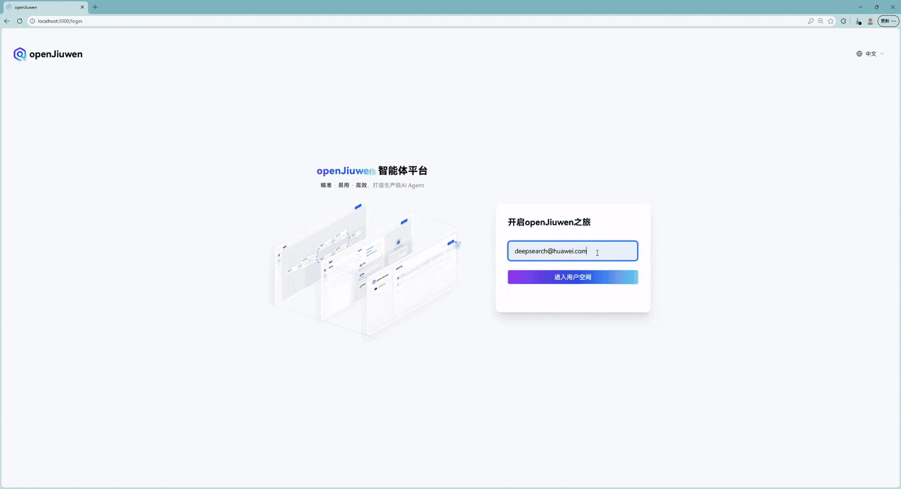

**Read this in:** [简体中文](./README.md) | English

# 🔬 What is openJiuwen-DeepSearch?

**openJiuwen-DeepSearch** is a knowledge-augmented, high-performance, high-precision deep retrieval and research engine. It combines structured knowledge and large language models with tools to deliver enterprise-grade Agentic AI search and research. Built on **openJiuwen agent-core**, it coordinates multiple agents for query planning, information gathering, understanding and reflection, and report generation—tackling complex reasoning and research workloads.

## Use cases

openJiuwen-DeepSearch provides deep search and deep research for enterprises and end users. This release focuses on **deep research**: multi-step workflows, multi-source validation, rigorous reasoning, and structured output for professional or high-stakes decisions.

- **Financial analysis reports**: Connect local investment and finance knowledge bases and web-augmented search to plan tasks, gather and analyze information (e.g. *“Impact of Fed rate cuts in 2025 on A-share tech stocks”*), and produce investment and finance reports.
- **Academic and policy research**: Use local or web-augmented sources for policies and implementation details, then plan, collect, analyze, and generate reports (e.g. *“Impact of China’s ‘new quality productive forces’ policy on manufacturing SMEs”*).

## Core capabilities

- **Example-driven report generation**
  - Start from a report template or extract structure from a sample report, then generate similar reports.
  - Samples can be Markdown, HTML, Word, PDF, etc.; templates can be exported.

- **Knowledge-augmented hybrid retrieval**
  - Local knowledge bases with keyword, vector, graph, and hybrid retrieval.
  - Hybrid retrieval across local corpora and the open web.
  - Online knowledge construction, evaluation, and refinement to improve fused search quality and reduce context cost.

- **Collaborative and interactive**
  - Natural-language feedback during planning.
  - Collaborative revision based on user feedback.

- **Segment-level provenance**
  - Validated citations in outputs and reports; preview and open sources.
  - Segment-level traceability and confidence.
  - Provenance reasoning and visualization for key claims.

- **Rich reports with visuals**
  - Reports with figures and charts; content remains traceable.
  - Markdown output and export to Word, HTML, and other formats.

## System architecture

The diagram below outlines the architecture. openJiuwen-DeepSearch is built mainly on **openJiuwen agent-core** and can connect to different LLMs and tools.

DeepSearch includes a manager, query planning, knowledge retrieval, understanding and analysis, and result generation:

- **Manager**: Agent creation, workflow orchestration, and configuration on the agent-core framework so agents coordinate efficiently.
- **Query planning**: Intent-based routing, structural planning, task decomposition, query rewriting, and related understanding to capture user intent and schedule work.
- **Knowledge retrieval**: Offline knowledge construction (parsing, chunking, index building) and online retrieval (keyword inverted index, vector search, knowledge-graph search, hybrid modes), plus pluggable web search.
- **Understanding and analysis**: Evaluate, refine, expand, and fuse retrieval results and other context.
- **Result generation**: Answers, report generation, interactive editing, and provenance.

**openJiuwen Studio** is an end-to-end AI Agent platform from build to deploy. **openJiuwen-DeepSearch** is a reference agent: manage models, tools, and knowledge in Studio, submit queries, and experience deep research and reports. **openJiuwen Ops** supports debugging, evaluation, observability, and tuning for agents including DeepSearch.

**Abbreviations**

- **agent-core**: openJiuwen agent-core  
- **Studio**: openJiuwen Studio  
- **DeepSearch**: openJiuwen-DeepSearch  
- **Ops**: openJiuwen Ops  

# 📦 Installation

This section points to full installation guides so you can deploy on common platforms.

## Full edition (UI + backend)

For users who want the **complete system** including the web UI:

- [Windows](./docs/en/2.Installation%20Guide/DeepSearch%20Full%20Edition/Windows%20Installation.md)
- [macOS](./docs/en/2.Installation%20Guide/DeepSearch%20Full%20Edition/macOS%20Installation.md)
- [Linux](./docs/en/2.Installation%20Guide/DeepSearch%20Full%20Edition/Linux%20Installation.md)

The default [Chinese README](./README.md) links to the same topics under `docs/zh/`.

## Other install paths

For custom builds, integration, or source-level debugging, see the SDK-oriented guides:

- [DeepSearch SDK installation](./docs/en/2.Installation%20Guide/DeepSearch_SDK/README.md)

More navigation: [Documentation hub](./docs/README.md).

# 🚀 Quick start

The animation below gives a fast tour of core features and the main workflow.

👉 For a full demo video, download the [complete video](https://openjiuwen-ci.obs.cn-north-4.myhuaweicloud.com/deepsearch/readme/9e6e857a424167500d4b4277485ea9b1_raw.mp4).  
👉 Step-by-step UI guide: [Quick Start](./docs/en/3.Quick%20Start/3.Quick%20Start.md).

**Note:** It is recommended to use a more powerful model (such as Qwen3-Max or GLM-5) to generate the report, so as to balance output quality and generation stability. If the model’s capability or concurrency handling is insufficient, it may affect the quality or completeness of the report.

# 💻 Developer guide

To work from source or extend DeepSearch, see the [Developer Guide](./docs/en/4.Developer%20Guide/README.md). Contributions are welcome.

**Note:** Except when resuming the **same** task (e.g. HITL clarification, outline interaction, cancellation), each call to the DeepSearch SDK **`run`** API should use a **new** `conversation_id`. Do not reuse a `conversation_id` across unrelated runs.

# ❓ FAQ

[FAQ](./docs/en/5.FAQ/README.md).

# ⚖️ License

This project is licensed under **Apache 2.0**. See the [LICENSE](LICENSE) file.

# 🤝 Contributing

Issues and pull requests are welcome. See the [contribution guide](https://www.openjiuwen.com/contribute).
