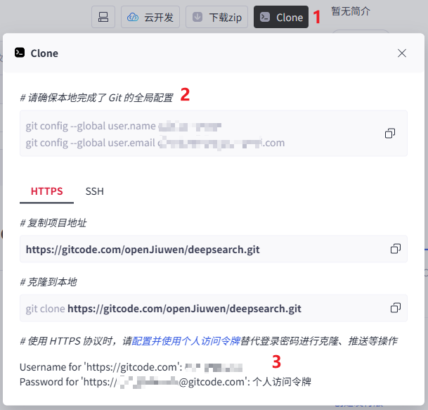

本指南介绍在 Windows 系统采用本地方式安装 DeepSearch。

## 一、环境准备

请确保机器满足以下要求：

* 硬件：
  * CPU：最低 2 核，推荐 4 核及以上
  * RAM：最低 4GB，推荐 8GB 及以上

* 操作系统：Windows10及以上

* 软件（安装方法详见下文）
  * Git 2.40及以上
  * Python 3.11及以上，3.14以下
  * uv 0.5.0及以上
  * MySQL 8.0及以上
  * PowerShell 5.1及以上（可运行 `$PSVersionTable.PSVersion` 查看）

## 二、安装方法

进行正式安装前需先完成依赖的安装，再执行源码获取和安装等后续步骤。

#### 1. 安装依赖

##### 1.1. 安装 Git

* 下载 <a href="https://mirrors.huaweicloud.com/git-for-windows/v2.51.0.windows.1/Git-2.51.0-64-bit.exe" target="_blank" rel="nofollow noopener noreferrer"> Git</a> 安装包，若下载耗时较长，请切换网络后重试。

* 安装完成后，打开 “PowerShell”，输入：`git --version`，若安装成功会输出 git 版本号。

##### 1.2. 安装 Python 和 uv

* 下载 <a href="https://www.python.org/ftp/python/3.11.4/python-3.11.4-amd64.exe" target="_blank" rel="nofollow noopener noreferrer"> Python</a> 安装包，按照提示完成安装（建议勾选 **Add Python to PATH**）。若下载耗时较长，请切换网络后重试。

* 安装完成后，打开 “PowerShell”，输入：`python --version`，若安装成功会输出 python 版本号。

* 打开 “PowerShell”，输入：`pip install uv` 安装 uv。

* 安装完成后，输入：`uv --version`，若安装成功会输出 uv 版本号。

##### 1.3. 安装 MySQL（可选组件）

* **SQLite vs MySQL**：
  * SQLite 无需额外安装和配置，适合开发和测试环境，但功能受限（如不支持高并发写入、无用户权限管理等）。
  * MySQL 功能更完善，能够满足复杂场景的需求，因此在实际工程和生产环境中更推荐使用。

###### 1.3.1 SQLite

* **说明**：默认使用 SQLite，只需 `.env.example` 保持 `DB_TYPE` 为 `sqlite` 即可直接启动后端服务，无需额外安装或配置。

###### 1.3.2 MySQL

* **说明**：若需使用 MySQL，请将 `.env.example` 中的 `DB_TYPE` 改为 `mysql`，并按照下列步骤完成 MySQL 的安装与配置。

* 下载 <a href="https://dev.mysql.com/get/Downloads/MySQL-8.4/mysql-8.4.7-winx64.msi" target="_blank" rel="nofollow noopener noreferrer"> MySQL 8.4</a> 安装包。

* 双击下载完成的安装包，跟随安装向导完成安装流程；建议选择 Typical 模式。

  > **注意**：在安装 MySQL 时如遇到 “This application requires Visual Studio 2019 x64 Redistributable”，请下载 Microsoft Visual C++ 官网 <a href="https://aka.ms/vc14/vc_redist.x64.exe" target="_blank" rel="nofollow noopener noreferrer">最新受支持的 Visual C++ x64 版本安装包</a>。

* 安装完成后，配置 MySQL 的 root 密码，请记住该密码。

* 按下 `Win+R` → 输入以下命令，打开「环境变量」窗口：

  ```
  rundll32.exe sysdm.cpl,EditEnvironmentVariables
  ```

* 将 MySQL 的 bin 目录添加至系统环境变量（MySQL 的默认 bin 路径：`C:\Program Files\MySQL\MySQL Server 8.4\bin`）

* 安装完成后，打开 “PowerShell”，登录 MySQL（输入安装时设置的 root 密码）：
   
  ```bash
  mysql -u root -p
  ```

* 在 MySQL 中执行以下命令创建数据库：
  > 说明：`your_user_name`、`your_password` 需自行设置，后续配置 .env 文件将会用到。

  ```sql
  # 新建数据库
  CREATE DATABASE openjiuwen_deepsearch;
  # 新建 MySQL 用户
  CREATE USER 'your_user_name'@'localhost' IDENTIFIED BY 'your_password';
  # 用户授权并刷新
  GRANT ALL PRIVILEGES ON openjiuwen_deepsearch.* TO 'your_user_name'@'localhost';
  FLUSH PRIVILEGES;
  ```

#### 2. DeepSearch 安装

##### 2.1. 获取源码

* 请确认已获取 <a href="https://gitcode.com/openJiuwen/deepsearch" target="_blank" rel="nofollow noopener noreferrer"> DeepSearch 代码仓</a> 的访问权限，若无权限请及时申请。

* 在 gitcode 代码仓按照图示步骤 2 获取 Git 的全局配置，输入以下命令配置 Git：

  ```bash
  git config --global user.name your_username
  git config --global user.email your_useremail
  ```

  

* 按照图示步骤 3 获取个人访问令牌，克隆代码时需要输入 gitcode 账号以及个人访问令牌。

* 新建 openJiuwen 目录，在 openJiuwen 目录打开 “PowerShell”，执行以下命令克隆源码并进入源码根目录：

  ```bash
  # 安装过程需要多次 git 操作，建议配置凭证存储，避免认证错误。
  git config --global credential.helper store

  git clone https://gitcode.com/openJiuwen/deepsearch.git
  cd deepsearch
  ```

##### 2.2. 启动 DeepSearch

* 在源码根目录打开 “PowerShell”；

* 复制 *.env* 文件：

  ```bash
  copy .env.example .env
  ```

* 使用文本编辑器打开 *.env* 文件，请根据实际情况修改文件中以下变量的值（勿覆盖其他变量）：

  > **说明**：<br>
  > HOST、BACKEND_PORT分别是DeepSearch服务的API地址和端口号。当环境变量中不填该值时，默认Host为`0.0.0.0`，端口号为`8000`。<br>
  > DB_HOST、DB_PORT 等变量的值可替换为实际数据库信息，DB_USER、DB_PASSWORD 为上文新建的 MySQL 用户与密码。如果密码中包含特殊字符，可参考 [特殊字符转义表](#windows-special-char) 将特殊字符替换为 URL 编码。

  ```env
   # 配置API地址和端口号（样例）
   BACKEND_PORT=6000
   HOST=127.0.0.1

   # 配置数据库（样例）
   DB_HOST=localhost
   DB_PORT=3306
   DB_USER=your_user_name
   DB_PASSWORD=your_password  
   ```

  变量说明可参考如下表格。
 
   | 变量名                                   | 变量说明                                                               | 配置样例                                                                      |
   |---------------------------------------|--------------------------------------------------------------------|---------------------------------------------------------------------------|
   | **BACKEND_PORT**                      | DeepSearch服务的API端口号。如果要搭配Studio前端使用，该端口号需要与Studio配置文件.env中的`DEEPSEARCH_AGENT_PORT`一致。       | `6000`                     |
   | **HOST**                              | DeepSearch服务的API地址。如果要搭配Studio前端使用，该地址需要与Studio配置文件.env中的`DEEPSEARCH_AGENT_HOST`一致。    | `127.0.0.1`          |
   | **DB_TYPE**                           | 数据库类型，可选：mysql/sqlite                                              | `sqlite`                                                               |
   | **DB_HOST**                           | mysql数据库的主机地址                                                       | `localhost`                                                               |
   | **DB_PORT**                           | mysql数据库的端口号                                                         | `3306`                                                                    |
   | **DB_USER**                           | mysql数据库的用户名                                                         | `your_user_name`                                                             |
   | **DB_PASSWORD**                       | mysql数据库的密码                                                           | `your_password`                                                         |
   | **DEEPSEARCH_DB_NAME**                | mysql数据库名                                                               | `openjiuwen_deepsearch`                                                         |
   | **SQLITE_DB_PATH**                    | sqlite数据库的保存路径                                                       | `data/databases`                                                         |
   | **DEEPSEARCH_SQLITE_DB**              | sqlite数据库的保存文件名                                                     | `agent.db`                                                         |
   | **CHECKPOINTER_TYPE**                 | Checkpointer类型，可选：`in_memory`（开发测试）/ `persistence`（单机生产）/ `redis`（分布式生产） | `in_memory`                                                         |
   | **CHECKPOINTER_DB_TYPE**              | Persistence模式的数据库类型，可选：`sqlite` / `shelve`（仅 CHECKPOINTER_TYPE=persistence 时需要） | `sqlite`                                                         |
   | **CHECKPOINTER_DB_PATH**               | Persistence模式的数据库路径（仅 CHECKPOINTER_TYPE=persistence 时需要） | `data/databases/checkpointer.db`                                                         |
   | **REDIS_URL**                         | Redis连接URL（仅 CHECKPOINTER_TYPE=redis 时需要） | `redis://localhost:6379`                                                         |
   | **REDIS_CLUSTER_MODE**                | 是否启用Redis Cluster模式（仅 CHECKPOINTER_TYPE=redis 时需要） | `false`                                                         |
   | **REDIS_TTL**                         | Redis中会话状态的默认过期时间（仅 CHECKPOINTER_TYPE=redis 时需要） | `7200`                                                         |
   | **REDIS_REFRESH_ON_READ**             | 每次读取会话状态时是否刷新TTL（仅 CHECKPOINTER_TYPE=redis 时需要） | `true`                                                         |
   | **INDEX_MANAGER_TYPE**                | 知识库向量索引类型，当前支持：`milvus` | `milvus`                                                         |
   | **MILVUS_HOST**                       | Milvus 服务地址 | `localhost`                                                         |
   | **MILVUS_PORT**                       | Milvus 服务端口 | `19530`                                                         |
   | **MILVUS_TOKEN**                      | Milvus 认证 token，无认证时留空；run 接口要求 token 为字符串，未配置会报错 | 留空或填写实际 token                                                         |
   | **EMBEDDING_SSL_VERIFY**              | 知识库 Embedding HTTPS 是否校验证书；未设置或空白时视为关闭校验 | `false`                                                         |
   | **EMBEDDING_SSL_CERT**                | 自定义 CA/证书 PEM 路径（自签或企业 CA 时填写；仅走系统信任链时可留空） | 留空                                                         |
   | **HUAWEICLOUD_KMS_ENABLED**           | 是否启用华为云 KMS 加解密（用于解密敏感配置） | `false`                                                         |
   | **OBS_ACCESS_KEY_ID**                 | 对象存储访问密钥 ID | 留空                                                         |
   | **OBS_SECRET_ACCESS_KEY**             | 对象存储访问密钥 Secret | 留空                                                         |
   | **OBS_SERVER**                        | S3 兼容 Endpoint URL | 留空                                                         |
   | **OBS_REGION**                        | 区域名称 | 留空                                                         |
   | **OBS_BUCKET**                        | 存储桶名称 | 留空                                                         |

  > **说明**：Checkpointer 用于管理 Agent 工作流的会话状态，支持工作流的暂停、恢复和状态持久化。
  > - `in_memory` 模式：无需额外配置，适用于开发测试环境，不支持分布式部署；知识库上传的文档仅存服务端本地，不使用对象存储
  > - `persistence` 模式：需要确保数据库目录有写权限，适用于单机生产环境；知识库文档同样仅存本地，不使用对象存储
  > - `redis` 模式：需要先安装并启动 Redis 服务，适用于分布式生产环境；**还须**在 `.env` 中完整配置 `OBS_SERVER`、`OBS_BUCKET`、`OBS_REGION`、`OBS_ACCESS_KEY_ID`、`OBS_SECRET_ACCESS_KEY`，否则服务无法启动。**仅在此模式下**服务端会将知识库文档上传至对象存储，供多实例共享。**多实例时 `DB_TYPE` 必须为 `mysql` 且连接同一 MySQL**（知识库等元数据存于应用数据库；SQLite 为本地文件，进程间不共享）。

* 在源码根目录下打开 "PowerShell"，运行以下命令启动后端服务，并耐心等待：
   
  ```bash
  uv venv
  uv sync --group backend
  ```

  > **注意**：如果持续卡死超过 20 分钟，请按下 “Ctrl + C”，尝试增加或修改本目录下 “pyproject.toml” 文件中 [[tool.uv.index]] 的 url 值，切换成其他可用源后，再重新执行 `uv sync --group backend`。

  > **注意**：若执行 `uv sync --group backend` 失败，可尝试：`uv sync --group backend --native-tls`  强制使用系统原生TLS库（解决HTTPS下载兼容问题）

  ```bash
  # 启动
  uv run start_backend.py
  ```

  启动成功后，会输出 "Application startup complete"。


## 三、常见问题（FAQ）

<a id="windows-special-char"></a>
### 问题一：特殊字符转义表

| 字符   | URL编码 | 字符   | URL编码 | 字符   | URL编码 | 字符   | URL编码 | 字符   | URL编码 |
|--------|---------|--------|---------|--------|---------|--------|---------|--------|---------|
| 空格 | %20    | "      | %22     | #      | %23     | %      | %25     | &   | %26     |
| (      | %28    | )      | %29     | +      | %2B     | ,      | %2C     | /      | %2F     |
| :      | %3A    | ;      | %3B     | <   | %3C     | =      | %3D     | >   | %3E     |
| ?      | %3F    | @      | %40     | \      | %5C     | \|     | %7C     | -      | -       |

### 问题二：本地安装为何默认使用http协议而非https协议

在本地安装方式下，系统默认通过HTTP协议进行通信。这一设计主要考虑到本地环境通常用于开发与测试，避免强制要求证书配置，从而降低初始使用门槛。
相比之下，Docker安装方式已预置了HTTPS支持，用户无需额外配置即可直接使用安全通信。
如需在本地环境启用HTTPS，开发者需根据实际部署需求自行完成证书生成与配置。