DeepSearch是一款知识增强高性能、高精准深度检索与研究引擎。目标是有效利用结构化知识及大模型，融合各种工具，提供企业级Agentic AI 搜索及研究能力。本文介绍了如何使用DeepSearch进行报告生成的研究任务。

## 一、准备阶段

> **注意**：本产品提供了前端和后端两套工程，在上手之前需保证前后端工程已部署且运行正常，如未部署工程，请参考[DeepSearch完整版安装指导](../2.安装指导/DeepSearch完整版/README.md)进行安装部署。

### 1. 获取大模型API Key

DeepSearch的运行依赖大模型服务，可从主流大模型服务提供商购买大模型服务或本地搭建大模型服务。以下流程以华为云为例，介绍大模型服务的获取步骤。

* 点击<a href="https://console.huaweicloud.com/modelarts/?locale=zh-cn&region=cn-southwest-2#/model-studio/deployment" target="_blank" rel="nofollow noopener noreferrer">链接</a>进入华为云模型广场的在线推理模型界面。

* 选择合适的模型，点击“开通服务”。

  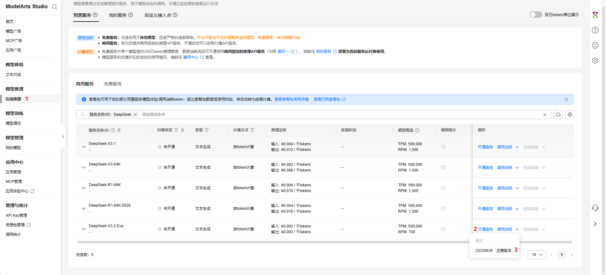

* 开通服务后，点击“调用说明”进入模型信息获取界面。

  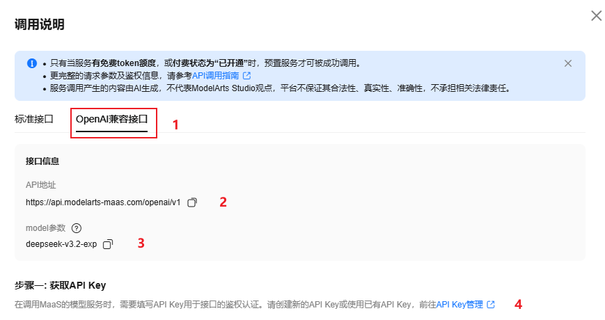

* 点击“OpenAI兼容接口”，记录*API地址*、*model参数*。

* 点击“API Key管理”，按照官方界面引导获取*API Key*。

> 说明：模型获取详细指导请参考 <a href="https://support.huaweicloud.com/usermanual-maas-modelarts/maas-modelarts-0195.html" target="_blank" rel="nofollow noopener noreferrer">华为云官方指导</a>

---

### 2. 获取联网增强引擎API Key

DeepSearch需要使用联网增强引擎来检索相关信息。用户可以从<a href="https://www.tavily.com/" target="_blank" rel="nofollow noopener noreferrer">Tavily</a>等联网增强引擎获取API Key。

> 说明：Tavily详细指导请参考 <a href="https://docs.tavily.com/documentation/about" target="_blank" rel="nofollow noopener noreferrer">Tavily官方指导</a>

---

### 3. 模型配置

进入模型管理界面，点击“添加模型”。在模型配置界面中，依次填入`模型名称`、`模型ID`、`API 密钥`、`基础服务地址`以及`描述`。

* **模型名称**​：系统显示名称，用户可自定义。
* **模型ID**​：由模型服务提供商定义的调用名称，可在各提供商的官方网站查询。（对应从华为云获取的*model参数*）
* **API 密钥**：模型的API Key（对应从华为云获取的*API Key*）
* **基础服务地址**：由模型服务提供商定义的API地址，可在各提供商的官方网站查询。（对应从华为云获取的*API地址*）
* **描述**：模型的详细描述，用户可自定义

  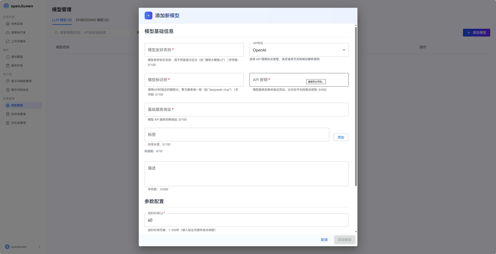

openJiuwen 提供了便捷的模型测试功能。

* 在模型管理界面中，点击已添加的模型的测试按钮；

* 选择一个常用测试语句点击；

* 点击开始按钮，稍作等待后输出“测试成功”表示模型配置成功。

  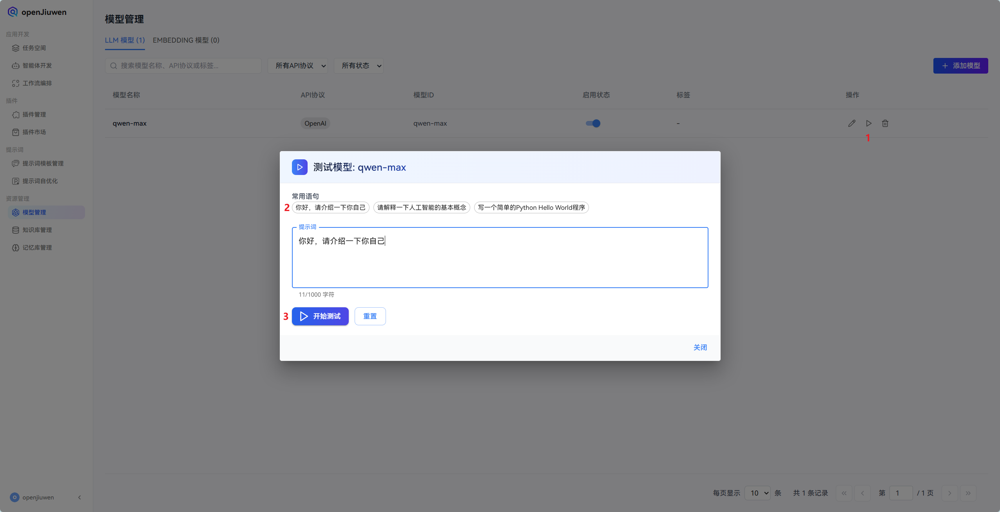

> 说明：若模型测试失败，请确认提供的模型配置信息是否正确。

---

## 二、探索应用

### 1. 前置设置

点击“任务空间”，进入智能体对话界面。
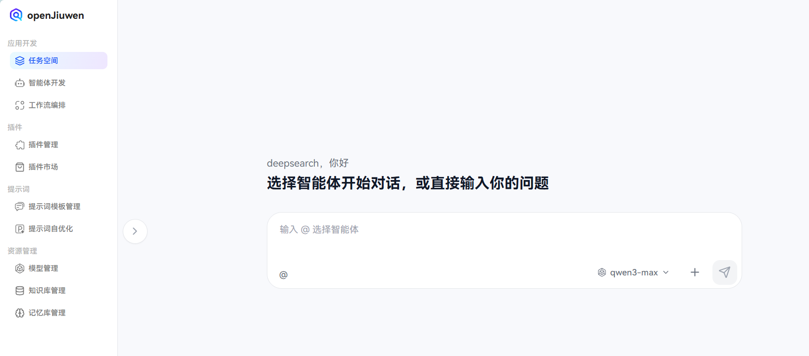

使用 DeepSearch 智能体前，需完成以下设置。

---

#### 选择DeepSearch智能体

在对话输入框输入 `@DeepSearch` 选择智能体。

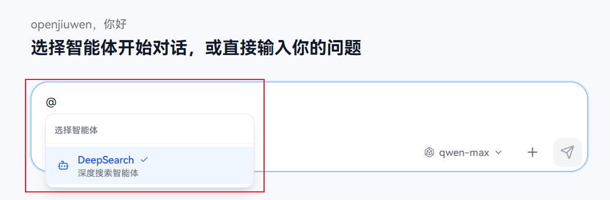

首次选择或配置未完成时，将弹出智能体配置界面，可按照下面[智能体配置](#智能体配置)章节进行配置，确认后点击"保存配置"即可。

> 说明：保存配置后，DeepSearch 智能体才被激活。

---

#### 智能体配置

点击 DeepSearch 智能体右侧的"配置"按钮进入配置界面。

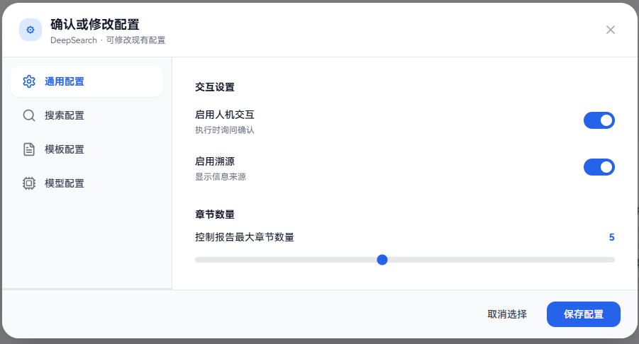

配置界面包含三个标签页，对应不同的功能设置。

> 说明：配置完成后点击"保存配置"应用设置。

#### 通用配置

通用配置包含交互设置和规划设置两部分。

* **启用问答交互**：开启后，在任务规划前会通过提问进一步理解用户需求。
* **大纲交互**：开启后，允许用户在报告大纲生成后对大纲进行多轮修改确认。
* **报告局部优化**：开启后，支持在报告生成完成后对选中的局部文本进行扩写、润色或缩写。
* **启用溯源**：开启后，会在结果中显示信息来源。
* **章节数量**：控制报告最大章节数量，代表智能体规划的详细程度，范围 1-15，数值越大规划越详细。

#### 搜索配置

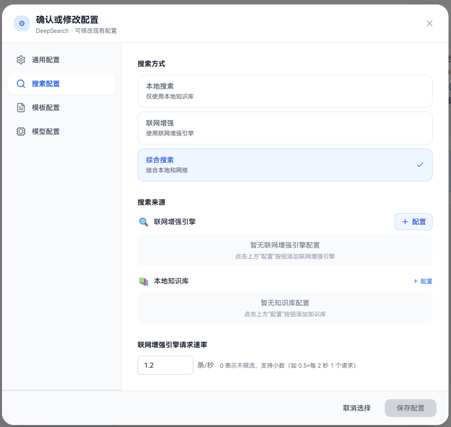

搜索配置包含搜索方式、搜索来源和请求速率控制三部分。

**搜索方式**：选择搜索模式
- **本地搜索**：仅使用本地知识库
- **联网增强**：使用联网增强引擎
- **综合搜索**：结合本地与网络搜索

> 说明：不同的搜索方式将影响后续可配置的搜索来源。

**搜索来源**：根据搜索方式配置对应来源
- **联网增强引擎**：点击"配置"添加联网增强引擎，支持讯飞搜索、小艺AI问答联网增强、Tavily、Google 及自定义引擎。
- **本地知识库**：点击"配置"选择知识库，支持多选。知识库支持多选，不同知识库以卡片形式展示。

  知识库状态说明：
  - **可用（绿色）**：知识库已就绪，可正常使用
  - **处理中（灰色）**：知识库正在处理中，暂不可用
  - **失败（红色）**：知识库处理失败，无法使用

  > 说明：只有状态为"可用"的知识库才会在研究过程中被调用。使用前请先在知识库管理页面创建知识库并同步至 DeepSearch。

**请求速率控制**：控制联网增强引擎的请求频率
- QPS：每秒发送的搜索请求数量，默认为 0 表示不限流
- 支持小数设置，例如 0.5 表示每 2 秒发送 1 个请求

  > 说明：设置合理的 QPS 值可以避免触发搜索引擎的频率限制，同时控制资源消耗。

#### 模板配置（可选）

如果想指定报告输出格式，可通过模板配置设置报告输出格式。

* **可用模板**：从模板列表选择报告模板，智能体将按模板格式生成报告。

* **导入新模板**：点击"上传新模板"，基于样例报告抽取模板
  * **提取生成**：从样例报告自动提取模板结构，支持 Markdown、HTML、Word、PDF 格式。
     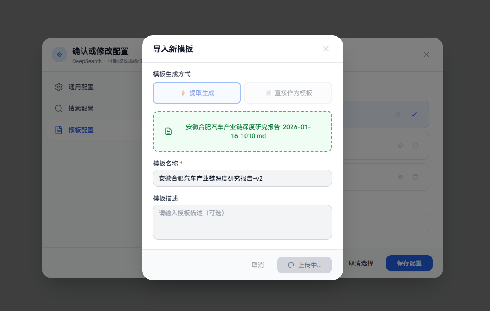
  * **直接作为模板**：直接将 Markdown 文件作为模板使用。
     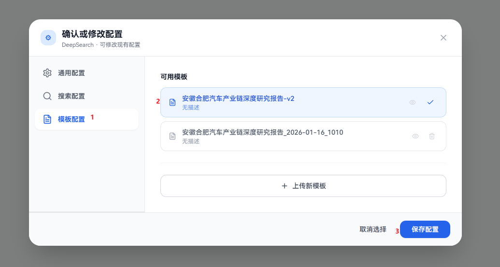

> 说明：模板为可选项，可根据需要选择或导入自定义模板。

#### 模型配置

模型配置允许用户为 DeepSearch 的不同研究阶段指定不同的模型，以优化效果与成本。

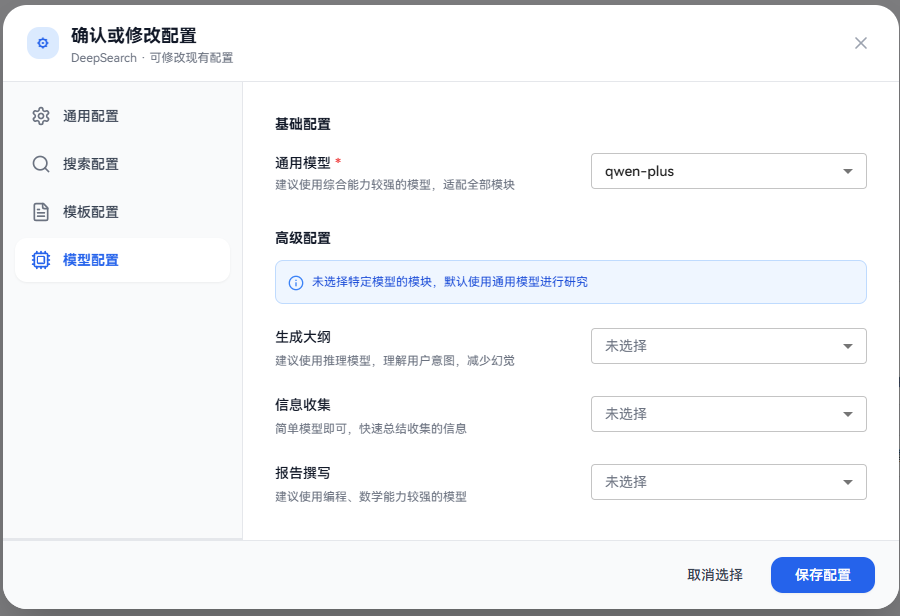

模型配置分为**基础配置**和**高级配置**两部分：

**基础配置**

- **通用模型**（必选）：作为默认模型，当高级配置中未指定特定模型时，所有模块均使用通用模型进行研究，建议使用综合能力较强的模型。

**高级配置**（可选）
高级配置允许用户为研究流程的不同阶段分别指定模型，未选择的模块将自动使用基础配置中的通用模型。

- **生成大纲**：建议使用推理能力较强的模型，以准确理解用户意图，减少幻觉。
- **信息收集**：简单模型即可，用于快速总结收集的信息，可选择轻量级模型以节省成本。
- **报告撰写**：建议使用编程、数学能力较强的模型，以确保报告的专业性和准确性。

> **说明**：高级配置为可选项，若未配置特定阶段的模型，系统将统一使用通用模型完成全部研究流程。配置的模型需支持 **Function Call** 能力，以确保智能体能够正确调用工具完成任务。

---

#### 选择模型

在对话界面右上角点击模型选择器，选择已配置的模型。

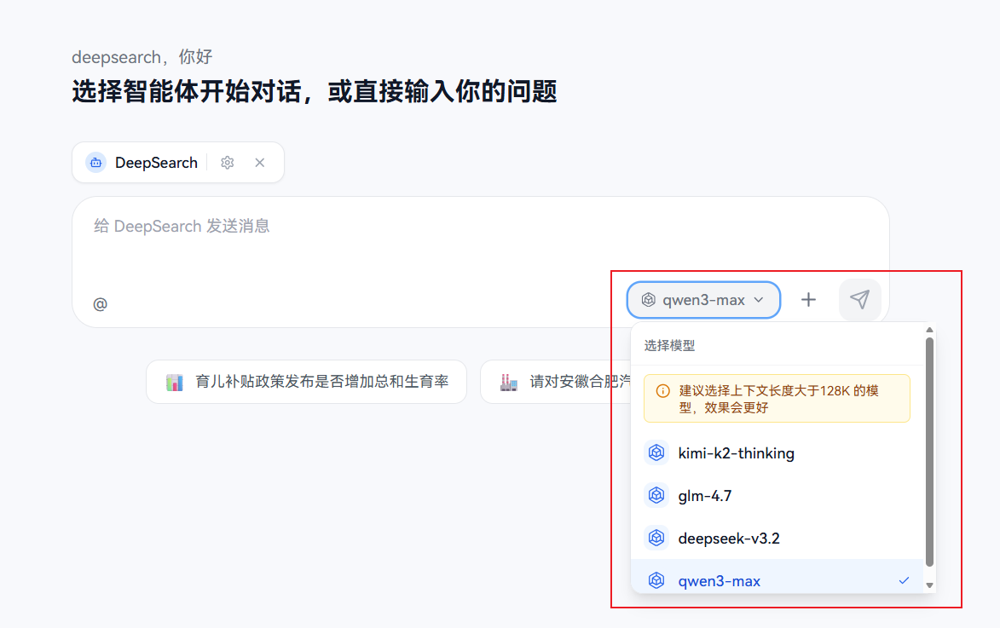

> 说明：使用 DeepSearch 智能体必须选择模型。若模型上下文长度低于 128K，可能影响深度研究报告效果。

---

### 2. 对话过程

#### 2.1 输入问题进行对话

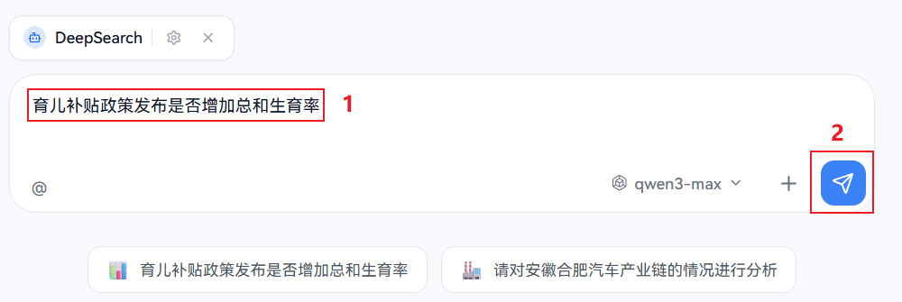

> **说明：** 
>
> - 用户在红框1中输入问题，点击红框2的发送按钮进行提问。 
> - 2种对话模式：人工交互模式(HITL)、非人工交互模式。 

##### 2.1.1 人工交互模式(HITL)

人工交互模式下，如果开启了相关的交互配置，用户与系统将经历多轮对话交互：

**用户查询意图交互**（在“通用配置”中开启人机交互相关配置）：

1. 用户提问，DeepSearch先根据所提问题进行补充提问。
   1. 下图红框1是黄色提醒标志，表示等待用户反馈更详细的指示；
   2. 用户在红框2中输入反馈并发送；
       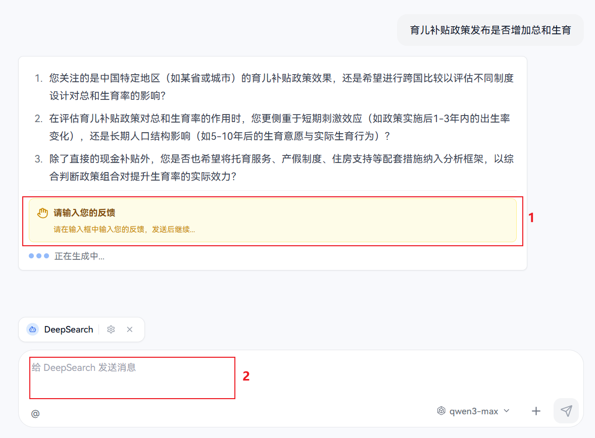
2. 用户发送反馈信息，DeepSearch根据用户的反馈，继续生成报告大纲。
   1. 下面红框3的绿色标志，表示用户已完成反馈；
   2. 红框4为用户反馈的信息；
   3. 红框5表示DeepSearch开始生成报告大纲；
       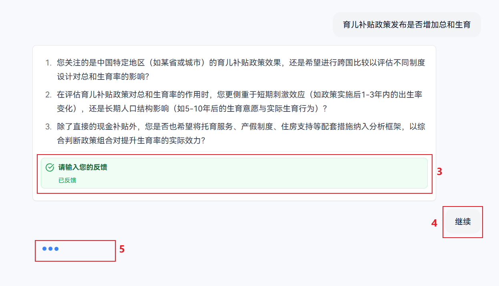

**大纲交互**（在“通用配置”中开启“大纲交互”）：

1. **大纲确认与评估**：DeepSearch 生成报告大纲后，系统会暂停执行，等待用户确认或修改大纲。
    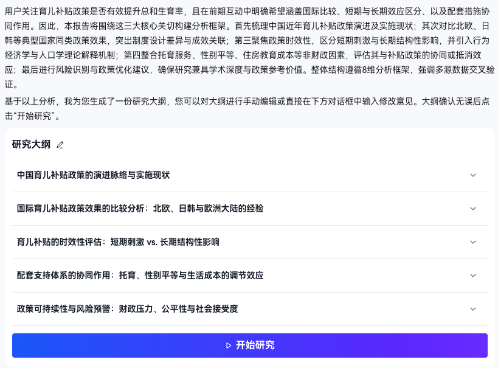
2. **大纲修改与优化**：用户可以点击“开始研究”接受当前大纲，也可以对大纲进行调整。系统提供了两种修改方式：
   - **通过反馈优化**：在对话框中提出修改意见，系统会根据用户的反馈重新生成大纲。
      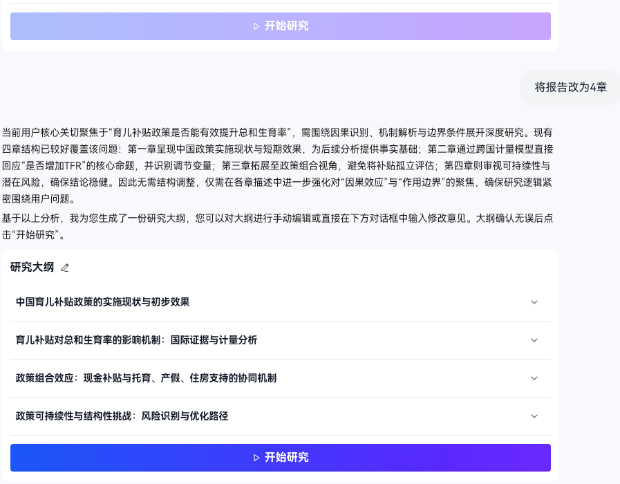
   - **手动编辑大纲**：点击大纲标题旁边的编辑按钮，直接手动修改大纲的标题或摘要等内容。
      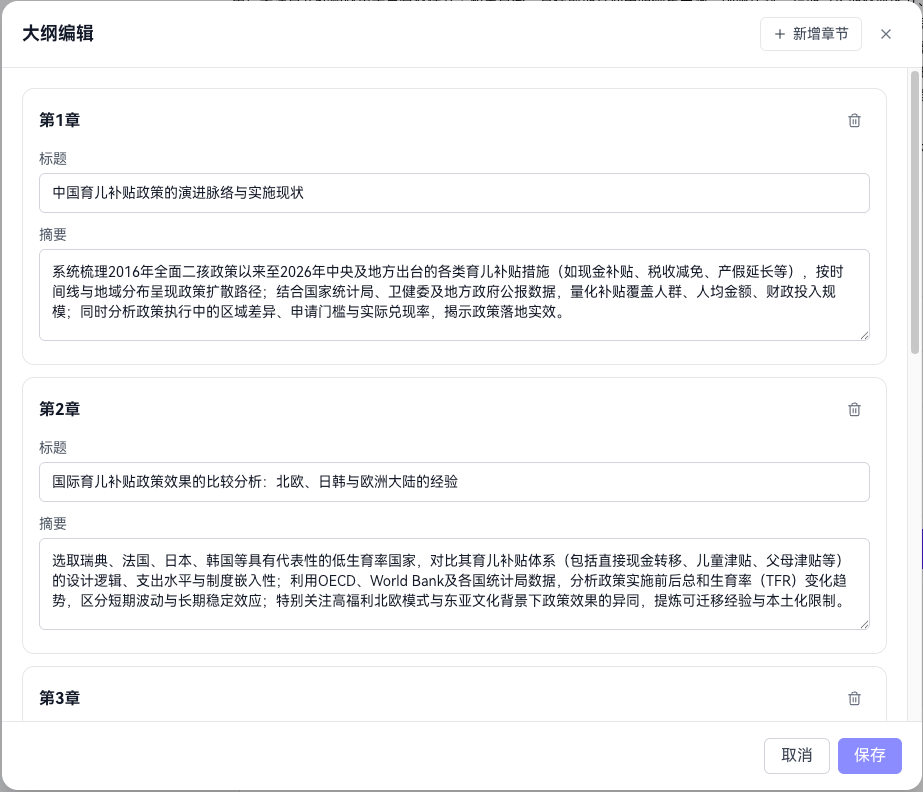
3. **生成报告**：大纲可进行多次修改与优化。大纲确认无误并点击“开始研究”后，DeepSearch 将正式开始撰写生成研究报告。

##### 2.1.2 非人工交互模式

非人工交互模式下，用户与系统经历1轮问答交互：

1. 用户提问；
2. DeepSearch根据用户的提问，直接生成报告；

> **注意**：无论哪种模式，生成报告步骤相同。因此下面以非人工交互模式为例，对生成报告的消息框进行详细说明。

---

#### 2.2 消息框详情

##### 2.2.1 消息框各模块说明

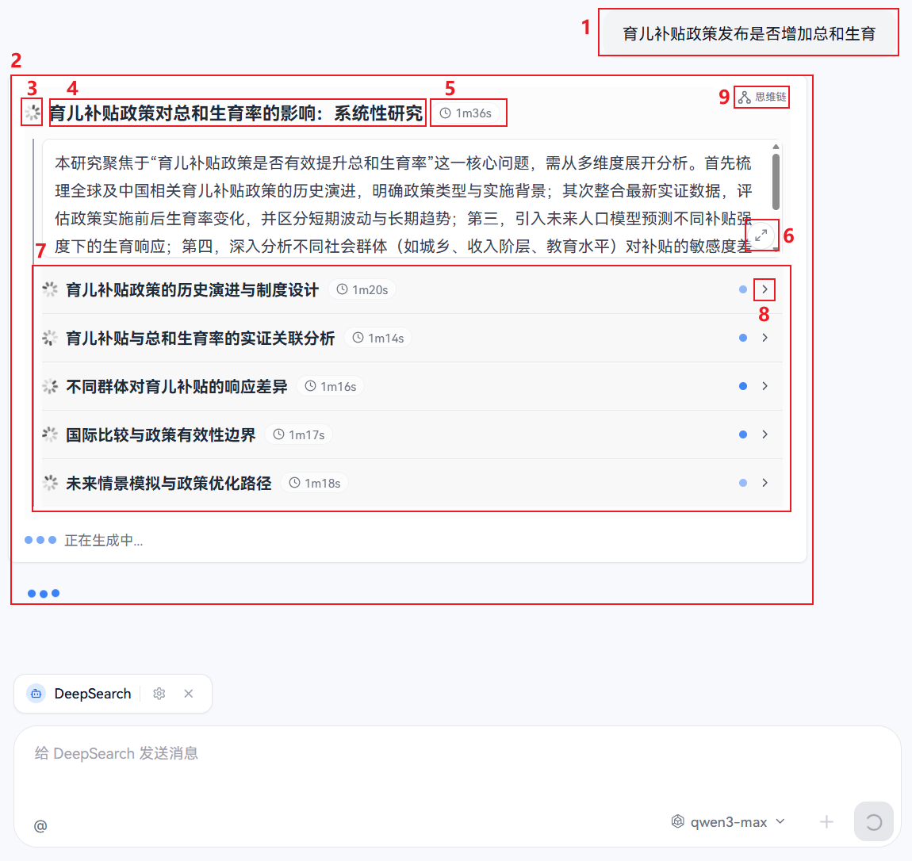

上图是提问后的用户及系统消息框，对各个红框的详细说明如下：

1. **红框1**：用户消息框，显示用户本次提问问题或反馈信息；
2. **红框2**：系统消息框，显示DeepSearch本次回复内容；
3. **红框3**：进展标志，表示此模块的进展状态：
   1. 灰色边缘、内部镂空的小圆圈，表示未开始;
   2. 灰色转动小菊花动画，表示进行中；
   3. 绿底白勾的标志，表示已完成；
   4. 红色的失败标志, 表示失败；
   5. 黄色手动结束标志，表示手动结束；
4. **红框4**：当前章节的标题；
5. **红框5**：本章节的耗时显示，格式为 *d*h*m*s，其中 d/h/m/s 分别表示天/时/分/秒
   1. 未完成，数值会实时变化；
   2. 已完成，数值固定不变；
6. **红框6**：文本框的展开按钮，点击后文本框将完全展开；展开后会变化为折叠按钮，可以折叠文本框；
7. **红框7**：用于显示子章节；
8. **红框8**：子章节的展开/折叠按钮，用于展开/折叠子章节；
9. **红框9**：深度研究的思维链链接，点击后可在右侧面板查看详细的思维链。

---

##### 2.2.2 子章节的进展预览图

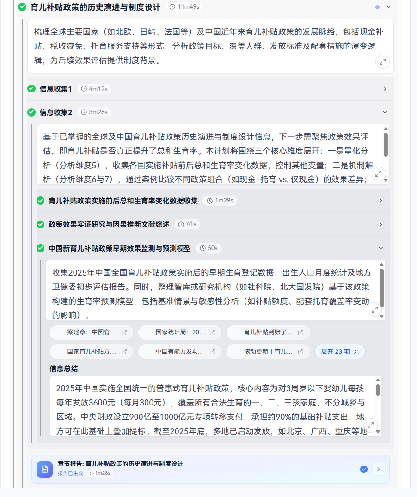

> 说明：上述图片展示了子章节的进展预览状态。

---

##### 2.2.3 外部引用示意图

外部引用是 DeepSearch 进行研究时，通过网络/本地搜索找到的知识引用。

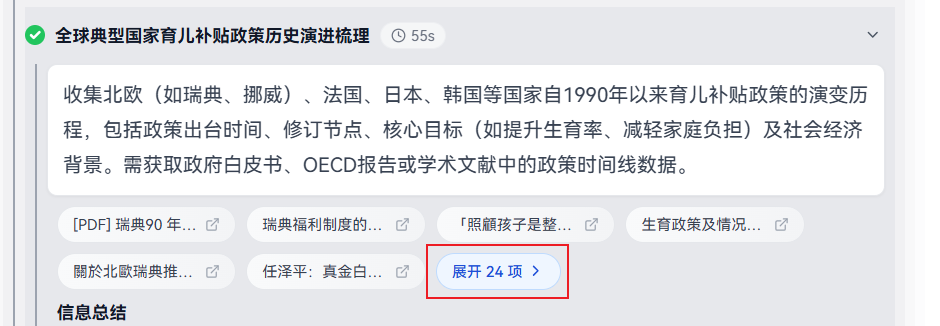 
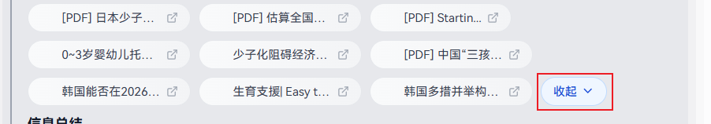

> 说明：上述两张图分别是外部引用在收起和展开情况下的展示，可通过点击收起/展开按钮进行切换。

---

##### 2.2.4 子章节报告示意图

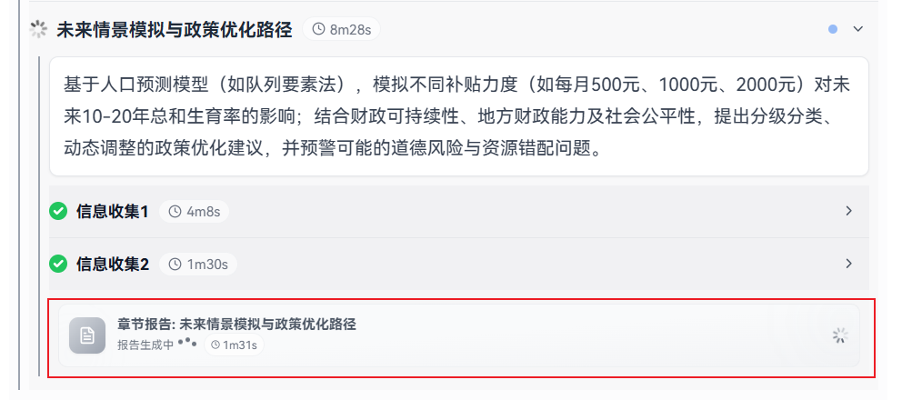 
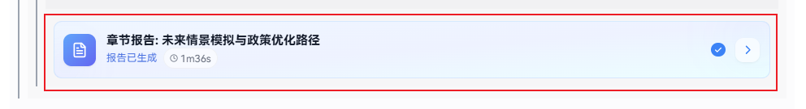

> 上述2图展示了子报告的2种状态： 
>
> - 生成中：灰色主题，显示用时，无法左键点击； 
> - 已生成：蓝色主题，显示用时，可左键点击，打开右侧面板显示详情(见下图)；

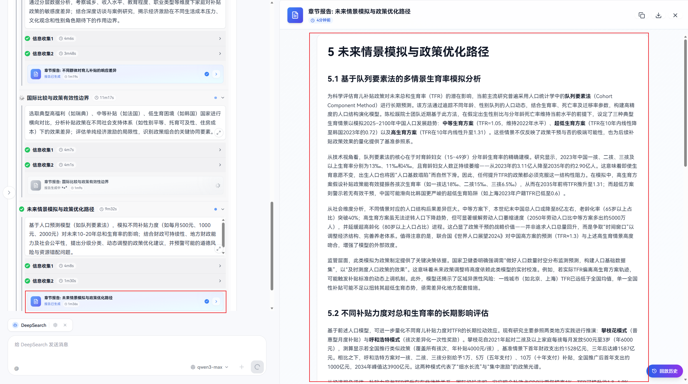

---

##### 2.2.5 思维链示意图
通过点击**思维链链接**（上述红框9），可打开右侧面板查看当前研究的思维链详情。思维链图会跟随当前研究进展而不断实时更新。
思维链一共2种类型的图：
1. **章节图**：展示当前研究中各个章节的依赖关系和执行顺序，通过该图可以清晰地了解当前研究的章节进度和依赖关系。
2. **任务图**：展示当前研究的各个章节、任务的详细进展，通过该图可以清晰地了解当前研究的具体任务进度和执行细节。

###### 2.2.5.1 章节图
 
> 说明：上图中，左图展示了思维链章节图的进行中状态，右图展示了思维链章节图的已完成状态。

###### 2.2.5.2 任务图
 
> 说明：上图中，左图展示了思维链任务图的进行中状态，右图展示了思维链任务图的已完成状态。

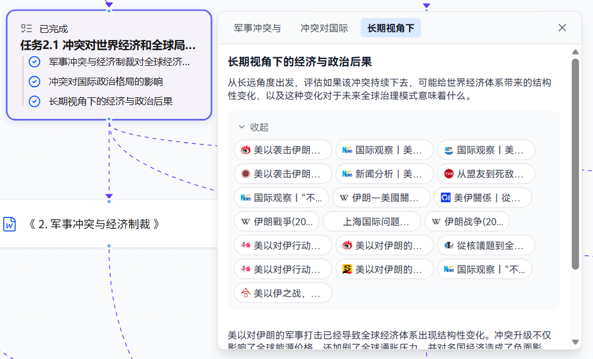
> 说明：左键点击任务节点，可展开任务详情，快速详细掌握任务及其各步骤的执行状态、信息收集、总结描述等。

###### 2.2.5.3 报告跳转
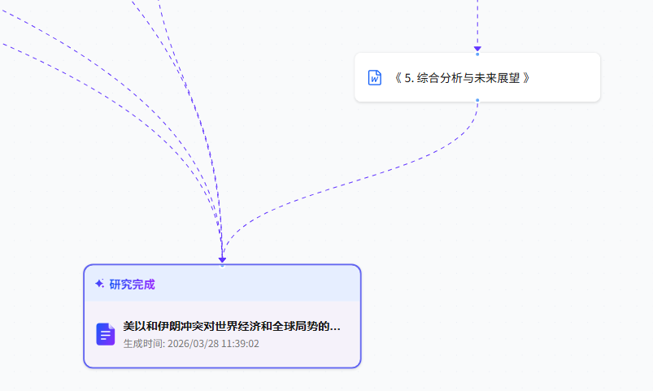
> 说明：章节报告或者总报告完成后，可通过左键点击报告节点进行跳转，此时右侧面板会由思维链图切换为报告展示。

---

##### 2.2.6 最终报告示意图

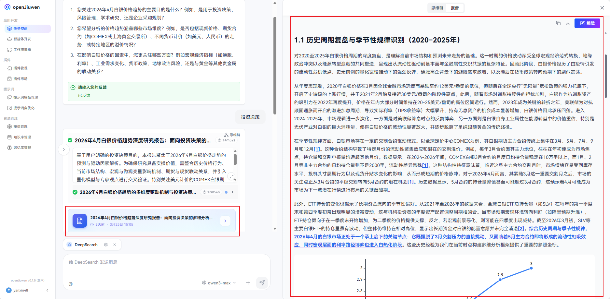

> 说明：上图是DeepSearch最终完成后的总效果图，左键点击总报告，可打开右侧详细页。

---

#### 2.3 历史对话管理

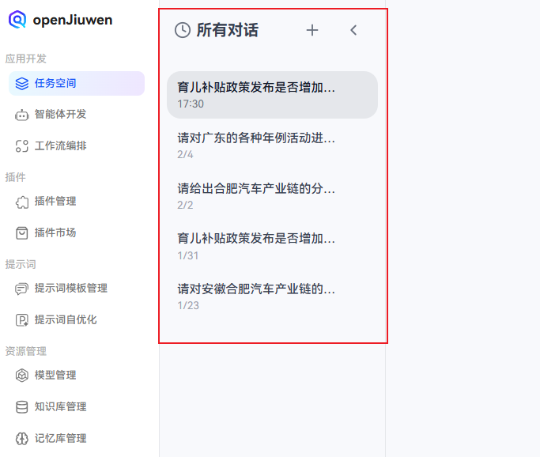

一次**对话**包含用户与系统的多轮问答交互，对话具备一定的上下文记忆。用户可在`所有对话`面板中，管理历史对话：

1. 折叠/打开`所有对话`面板；
2. 保存历史对话及其对话数据；
3. 新增对话；
4. 左键点击并切换至某个历史对话；
5. 删除某个对话；

---

### 3. 最终报告展示

在对话过程中，DeepSearch会根据用户输入的问题，利用大模型和联网增强引擎检索相关信息。检索到的信息会被大模型整合，生成符合用户需求的报告，用户可以在对话框中查看到最终报告的交互卡片。

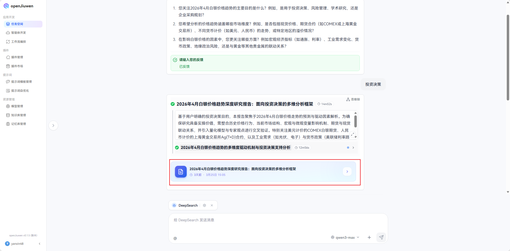

---

#### 3.1 浏览态界面

##### 3.1.1 查看最终报告

鼠标单击最终报告卡片，可以**打开**和**关闭**最终报告的详细内容。

可以通过滚动条查看报告的详细内容。

---

##### 3.1.2 查看引用详情

可以点击 **[1]** 这些引用，点击后可以打开引用的详细信息(如引用片段、来源、可信度等)。同时可以通过点击**web**跳转至引用的来源网页。

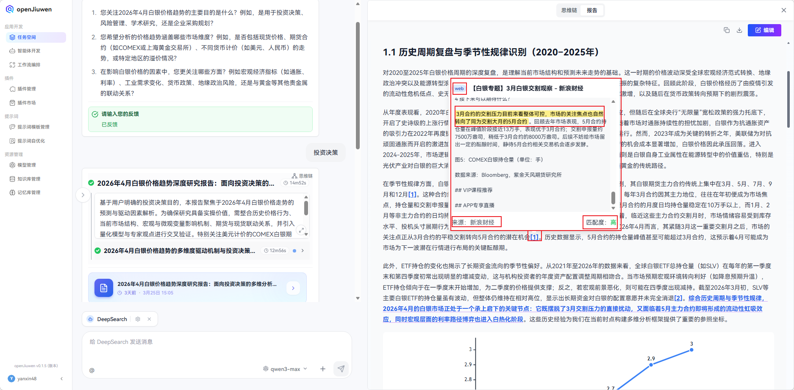

---

##### 3.1.3 报告下载

用户可以点击报告界面的**下载**按钮，将报告下载到本地。用户可以在本地查看和分享。用户可以选择下载报告的格式，目前支持**Markdown**、**HTML**和**DOCS**格式。

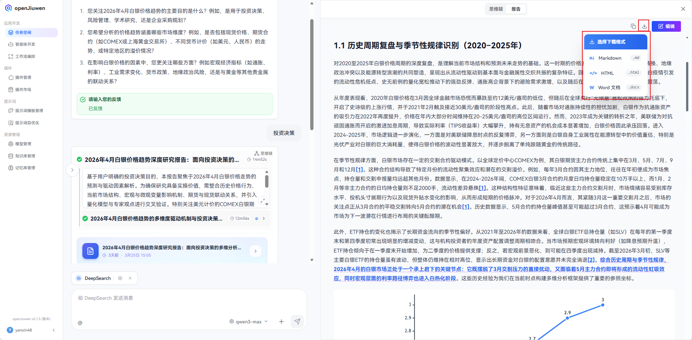

#### 3.2 编辑态界面

在启用用户反馈优化的状态下，可以点击编辑按钮进入编辑界面对最终报告进行编辑

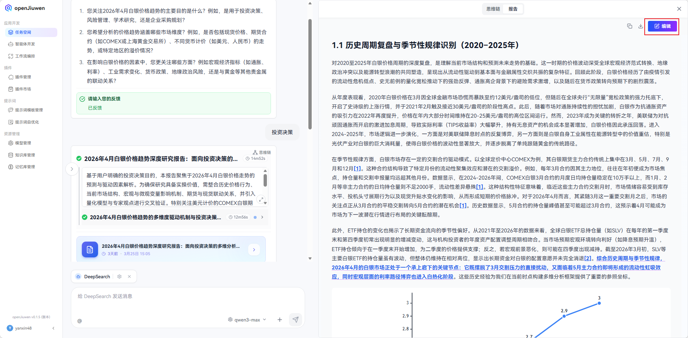

进入至编辑界面之后，报告以块文字来渲染，用户可以将鼠标悬停在块文字之上，即在块文字的左侧会出现星星的侧边栏按钮(AI改写)，将鼠标悬停至侧边栏时，则会框选整块文字

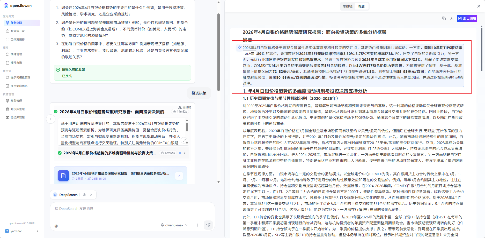

点击AI改写按钮之后，即打开AI改写输入界面，用户可以选择润色/扩写/缩写，并在输入框中输入意图，输入完成之后点击发送按钮即触发模型对报告进行AI改写

注意：当前只支持点击侧边栏进行AI改写，划词或者手动修改报告皆不触发AI改写，且为保证AI改写功能不受影响，请勿手动修改报告内容。

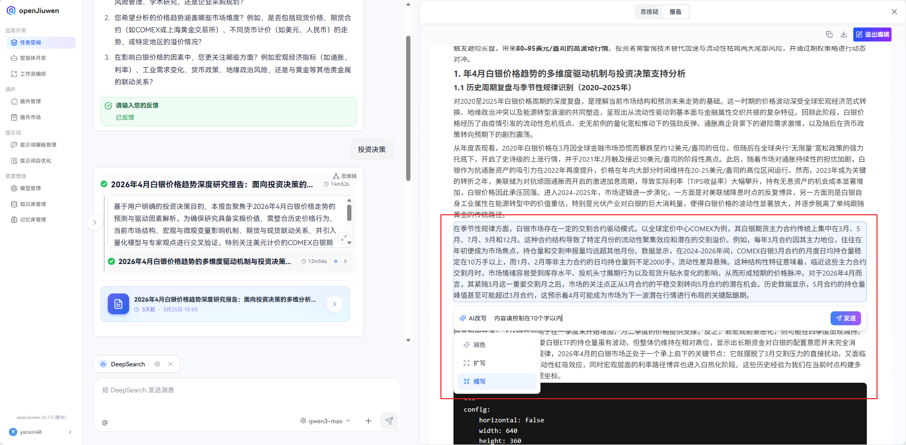

AI改写触发之后会在对话框中显示改写的行为，并在改写完成之后生成一个新的report卡片，同时在报告显示界面改写的地方也会更新。

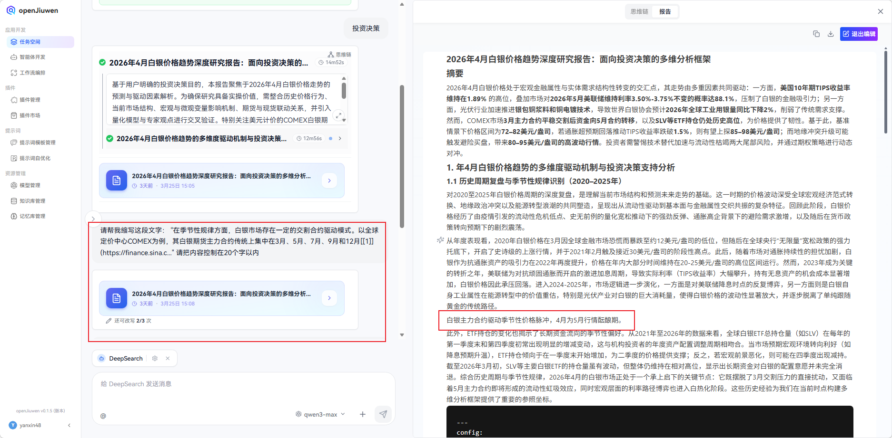

AI改写修改功能有修改轮次上限，请合理安排修改机会，达到轮次上限之后则报告不再支持AI改写。

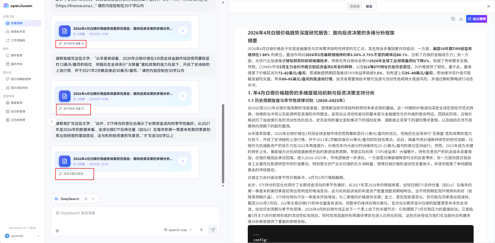

至此，DeepSearch的使用说明已完全介绍完毕。如需探索更多功能特性，可参考《开发指南》与《实践教程》相关内容。
