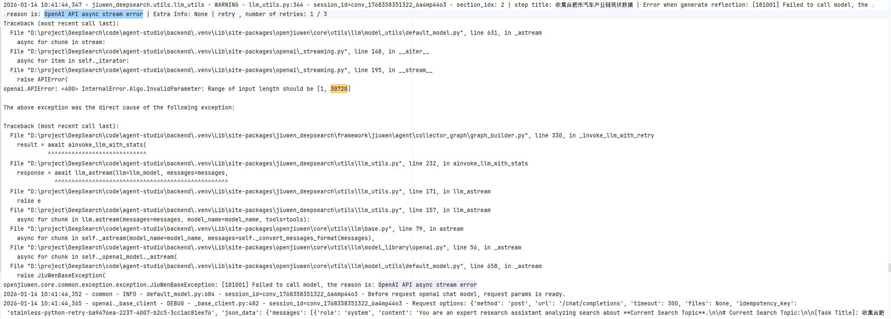

# FAQ

## 一、安装环境问题

### 1. uv 下载python超时报错

**> 报错信息**：

	Caused by: error decoding response body
	Caused by: request or response body error
	Caused by: operation timed out


**> 解决方案**：设置环境变量

① 配置镜像源
```sh
# 配置python下载镜像源（阿里源）
UV_PYTHON_INSTALL_MIRROR="https://registry.npmmirror.com/-/binary/python-build-standalone" uv python install
# 或者
uv python install --index https://registry.npmmirror.com/-/binary/python-build-standalone

其它可选源：
https://python-standalone.org/mirror/astral-sh/python-build-standalone/
```

② 或者增加超时时间
```sh
# 增加超时时间为300s
UV_HTTP_TIMEOUT=300 uv python install <可指定版本>
```


### 2. uv 下载python三方包超时报错

**> 报错信息**：

	╰─▶ I/O operation failed during extraction
	╰─▶ Failed to download distribution due to network timeout. Try increasing UV_HTTP_TIMEOUT (current value: 30s).


**> 解决方案**：配置python三方包镜像源
```sh
# 使用镜像源下载三方 python package（设置环境变量）
UV_INDEX_URL=http://mirrors.aliyun.com/pypi/simple/ uv add <package>
```


### 3. uv 下载ssl证书报错（针对未知网址域名）
  
**> 报错信息**：

	Caused by: client error (Connect)
	Caused by: invalid peer certificate: UnknownIssuer


**> 解决方案**：临时忽略不安全域名的证书认证，允许与目标主机的不安全连接

```sh
# --allow-insecure-host 也可替换为 --trusted-host
uv sync --allow-insecure-host github.com --allow-insecure-host pypi.org --allow-insecure-host files.pythonhosted.org
```

## 二、日志定位
### 1. 日志路径
openJiuwen-deepsearch运行日志文件通常位于项目根路径的 **output/logs/common** 下，系统实现了日志分流，包含两类日志：
- warning级别以上（方便快速定位错误日志）：**common_warning.log**
- 项目运行日志：**common.log**

补充说明：
- `common.log` 主要记录DeepSearch项目自身日志；第三方组件日志默认仅保留 `warning/error` 级别，`debug/info` 不会写入。
- 超长日志会自动截断，仅保留头尾关键片段；少数关键结果日志会显式跳过截断，便于排查引用、报告等完整输出。

## 三、模型相关错误
### 1. 模型服务调用失败或超时
含有 **stream error** 、**timeout**、**OpenAI API** 或 **Client connection error** 等字眼，基本都是模型调用失败。
- 访问模型服务超时
- 连接模型服务失败
- 输入超过了模型上下文长度

- 调用公有云模型的时候可能存在敏感信息过滤，导致模型调用失败
- 如果日志中出现 `LLM wall-clock timeout after ...`，表示命中了业务层外层总超时，来源于 `agent_llm_timeouts`，与底层 `service_config.llm_timeout` 不是同一层语义。此时应重点检查 `agent_llm_timeouts` 是否包含 `default`、对应节点规则是否过小，或是否误将某条规则配置为 `0`。

### 2. 模型返回结果不遵从
含有 **retry** 字眼，都是模型调用失败或者模型结果不遵从导致的。当遇到这种异常的时候，DS内部有重试机制，重试次数达到阈值才会出现 ERROR 失败，否则是 WARNNING 级别。


### 3. 节点异常影响范围
部分环节的模型调用重试失败影响不是很大，部分关键节点的重试失败可能有较大影响。可以判断日志的关键字眼来判断是否有影响。

- 影响较大的节点：可能会影响报告生成的完整性
```
entry：影响是否进行报告生成
outliner：影响整个报告大纲生成
planner：影响报告某一章节的任务规划，进而影响该章节的生成
sub_reportor：影响报告某一章节的生成
reportor：影响最后整个报告的的生成
```
- 影响较小的节点：对报告生成不会产生严重影响的
```
summary：某次搜索任务的总结，只影响当次搜索结果
reflection：某次搜索任务的反思，只影响当次搜索的深度
citation verify：某条搜索结果的溯源效验
```

### 4. 使用的模型限制
+ 由于当前deepsearch服务内的各项节点大量使用了function_call，所以不支持function_call的模型，无法使用deepsearch服务。

### 5. 模型并发限制
- 由于deepsearch服务内的信息收集和报告生成等节点允许并发执行，因此推荐使用并发能力较强的模型，例如qwen3-max等。如果使用的模型的并发能力较弱，限流策略和请求速率限制等可能会导致模型调用失败，触发`Allocated quota exceeded`等错误，进而影响报告生成的完整性。


## 四、联网增强引擎相关错误
### 1. 引擎直接访问失败
日志中存在ERROR错误，显示 Search request failed 等信息，则表示配置的联网增强引擎有问题，访问失败。
另外，从前端页面也可以看出，出现大篇幅的信息搜集为空，都是联网增强引擎有问题。

### 2. 联网增强引擎返回无结果
通过关键词 TOOL END 查找日志行，判断当前联网增强引擎类型以及是否有query对应的搜索结果 search_results。
- 如果全部search_results都为空，则搜索服务不可用，可能是搜索相关配置有误或联网增强引擎不可用，需要排查联网增强引擎
- 如果只是某一段时间的search_results都为空，则可能该时间段的联网增强引擎服务不可用了
- 如果只是某几条 search_results 空，则可能是对应query搜索不出结果，几乎没有什么影响

## 五、知识库 / 本地搜索相关错误

### 1. 创建知识库失败或无法连接 Milvus

**> 可能原因**：`MILVUS_HOST`、`MILVUS_PORT` 未正确配置或 Milvus 服务未启动。

**> 解决方案**：在 `.env` 中配置 `MILVUS_HOST` 和 `MILVUS_PORT`，确保与 Milvus 服务地址一致（默认 `localhost:19530`）。

### 2. run 接口报错：token 校验失败

**> 报错信息**：`Input should be a valid string [type=string_type, input_value=None, input_type=NoneType]`，涉及 `vector_store.token`。

**> 可能原因**：`MILVUS_TOKEN` 未配置时，系统传入 `None`，而本地搜索配置要求 token 为字符串类型。

**> 解决方案**：在 `.env` 中显式配置 `MILVUS_TOKEN`。若 Milvus 无认证，留空即可（系统会将空字符串作为默认值）。

### 3. 构建索引失败（Embedding 调用 SSL 错误）

**> 可能原因**：Embedding 服务为 HTTPS，证书校验与 `EMBEDDING_SSL_VERIFY`、`EMBEDDING_SSL_CERT` 不一致；例如显式开启校验但证书不可信、或自签地址未提供 CA 文件。

**> 解决方案**：在 `.env` 中按需配置（可参考 `.env.example`）：
- 不校验服务端证书：设置 `EMBEDDING_SSL_VERIFY=false`，或留空（通过本仓库 `server/main.py` 启动时，未设置或空白的 `EMBEDDING_SSL_VERIFY` 会按关闭校验处理）。
- 使用系统信任的公网 CA：可设置 `EMBEDDING_SSL_VERIFY=true`，`EMBEDDING_SSL_CERT` 可留空。
- 自签名或企业 CA：设置 `EMBEDDING_SSL_VERIFY=true` 且 `EMBEDDING_SSL_CERT=<PEM 证书路径>`。

## 六、服务相关错误
### 1. 部署限制
当前deepsearch服务支持分布式部署，同时限制单机单进程。如果想在单机部署多实例，也请使用redis模式进行部署。使用 `CHECKPOINTER_TYPE=redis` 时，**必须**将 `DB_TYPE` 设为 `mysql` 且各实例连接**同一** MySQL（知识库等元数据在应用库中）；若与 `DB_TYPE=sqlite` 同时配置，服务端在加载配置阶段即会校验失败、无法启动。此外还须完整配置对象存储（`OBS_SERVER`、`OBS_BUCKET`、`OBS_REGION`、`OBS_ACCESS_KEY_ID`、`OBS_SECRET_ACCESS_KEY`），否则服务无法启动；详见安装指导中 Checkpointer / OBS 说明。`in_memory` 与 `persistence` 模式下，知识库上传的文档仅保存在服务本地；即使环境中配置了 `OBS_*`，服务端也不会将其用于知识库上传。
### 2. 调用限制
除同一个任务内的中断恢复场景外，每次调用 deepsearch SDK 的 `run` 接口时，都应使用新的 `conversation_id`，不允许复用旧会话。

以下场景必须复用同一个 `conversation_id`：
- HITL（澄清问题）恢复。
- 大纲交互恢复。
- 报告生成完成后的局部优化交互。

### 3. 空间（space_id）与本地知识库

通过 **HTTP 服务**调用 `run` 时，请求体中的 `space_id` 表示租户/工作空间边界。`local_search_config.local_search_config_ids` 中的每个知识库 ID 必须在服务端数据库中登记为**属于该 `space_id`**；服务端会在构建本地检索前做校验，**不属于当前 `space_id` 的知识库无法被访问**。

服务端 `DeepSearchAgentManager` 对 Agent 实例做进程内缓存时，缓存键由**影响 Agent 构建的请求字段**稳定序列化后哈希得到（会排除 `message`、`conversation_id`、`interrupt_feedback` 等仅与当轮对话/会话标识相关的字段）。其中包含 **`space_id`**、**`local_search_config`（含 `local_search_config_ids`）**、联网检索配置、`llm_config`、工作流与检索相关开关等，因此**同一 `space_id` 下更换知识库或引擎配置也会生成新键**，不会误复用旧 Agent。

**说明**：`space_id` 由调用方在请求中传入。若需防止客户端伪造他人空间，应在网关或鉴权层将 `space_id` 与登录身份或令牌绑定后再转发。


## 七、附录
包含公共类型错误、业务节点的相关错误码信息：[详细错误码链接](https://gitcode.com/openJiuwen/deepsearch/blob/dev/openjiuwen_deepsearch/common/status_code.py)
